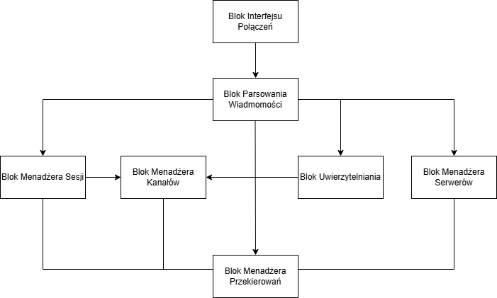

# Programowanie Sieciowe - PSIRC
*Bartosz Nowak, Łukasz Suchołbiak, Wojciech Sarwiński*

## 1. Treść Zadania

Celem projektu jest implementacja uproszczonego serwera IRC obsługującego uwierzytelnianie oraz komunikację między pojedynczymi użytkownikami, a także w kanałach (wraz z możliwością usuwania użytkowników z kanału).

## 2. Założenia

1. Funkcjonalne
    - Implementacja serwera IRC
    - Serwer IRC może połączyć się z innym serwerem IRC
    - Klient może połączyć się z serwerem IRC
    - Klient może dołączyć do istniejącego kanału na serwerze IRC
    - Klient może utworzyć nowy kanał
    - Klient może połączyć się z innym użytkownikiem w celu komunikacji między pojedynczymi użytkownikami
    - Serwer ma możliwość ustawienia hasła dostępu do serwera
    - Klient, który utworzył kanał, ma możliwość usuwania innych użytkowników
2. Niefunkcjonalne
    - Serwer musi być zabezpieczony przez nieutoryzowanym użyciem
    - Serwer musi obsługiwać wielu użytkowników na raz
    - System musi być intuicyjny i zrozumiały w obsłudze
    - Serwer musi płynnie kończyć działanie - obsługa `SIGTERM`, `SIGINT`

## 3. Przypadki użycia
**Korzystanie z serwera IRC przy użyciu dowolnego programu klienckiego IRC zgodnego z RFC 1459**
*Aktor: Użytkownik*
1. Użytkownik łączy się z działającym serwerem irc przy pomocu klienta IRC

**Komunikacja z grupą znajomych**

*Aktor: Użytkownik*
1. Użytkownik łączy się do działającego serwera IRC
2. Użytkownik łączy się z kanałem `#znajomi` podając swój pseudonim
3. Użytkownik komunikuje się ze znajomymi

**Komunikacja z uwierzytelnieniem**

*Aktor: Użytkownik*
1. Użytkownik łączy się do działającego serwera IRC
2. Użytkownik podaje hasło dostępu do serwera
3. Użytkownik łączy się z kanałem `#znajomi`, podając pseudonim i hasło dostępu
4. Użytkownik komunikuje się ze znajomimi

**Tworzenie kanału**

*Aktor: Użytkownik*
1. Użytkownik łączy sie do serwera IRC
2. Użytkownik tworzy kanał poprzez próbe połączenia z kanałem o nieistniejącej nazwie
3. Kanał zostaje stworzony
4. Użytkownik zostaje operatorem stworzonego kanału (chanop)

**Tworzenie serwera IRC bez uwierzytelnienia**

*Aktor: Administrator*
1. Administrator konfiguruje parametry uruchomienia serwera
2. Administrator uruchamia serwer IRC w sieci lokalnej
3. Administrator ustawia metodę uwierzytelniania na brak

**Tworzenie serwera IRC zabezpieczonego hasłem dostępu**

*Aktor: Administrator*
1. Administrator konfiguruje parametry uruchomienia serwera
2. Administrator uruchamia serwer IRC w sieci lokalnej
3. Administrator ustawia metodę uwierzytelniania na podane hasło dostępu

## 4. Analiza możliwych sytuacji błędnych i proponowana ich obsługa
### Przy próbie połączenia się z serwerem
1. **Użytkownik przy próbie połączenia się z serwerem zabezpieczonym hasłem podaje błędne hasło**
    - **Obsługa:** Serwer odsyła ERR_PASSWDMISMATCH i zrywa połączenie. Użytkownik powinien zmienić hasło i jeszcze raz podjąć próbę połączenia się z serwerem.
2. **Użytkownik próbuje połączyć się z serwerem używając pesudonimu, który jest już zajęty**
    - **Obsługa**: Serwer odpowiada ERR_NICKNAMEINUSE. Użytkownik powinien zmienić zmienić pseudonim i jeszcze raz podjąć próbę połączenia się z serwerem.
3. **Użytkownik próbuje połączyć się z serwerem nie podając pseudonimu**
    - **Obsługa**: Serwer odpowiada ERR_NONICKNAMEGIVEN. Użytkownik powinien zmienić pseudonim i jeszcze raz podjąć próbę połączenia się z serwerem.
4. **Użytkownik próbuje połączyć się z serwerem podając pseudonim nie spełniający [zasad składniowych](https://datatracker.ietf.org/doc/html/rfc1459#section-2.3.1)**
    - **Obsługa**: Serwer odpowiada ERR_ERRONEUSNICKNAME. Użytkownik powinien zmienić pseudonim i jeszcze raz podjąć próbę połączenia się z serwerem
5. **Użytkownik próbuję połączyć się z serwerem nie podając nazwy użytkownika i/lub prawdziwego imienia**
    - **Obsługa**: Serwer odpowiada ERR_NEEDMOREPARAMS. Użytkownik powinien uzupełnić brakujące dane i jeszcze raz podjąć próbę połączenia się z serwerem.
### Po połączeniu się z serwerem (poprawnym zarejestrowaniu połączenia)
#### Związane z serwerem
6. **Użytkownik próbuje uzyskać uprawnienia do zarządzania serwerem nie podając nazwy i/lub hasła**
    - **Obsługa**: Serwer odpowiada ERR_NEEDMOREPARAMS. Uprawnienia do zarządzania serwerem nie zostają przyznane użytkownikowi.
7. **Użytkownik próbuje uzyskać uprawnienia do zarządzania serwerem podając błędną nazwe i/lub hasło operatora**
    - **Obsługa**: Serwer odpowiada ERR_PASSWDMISMATCH. Uprawnienia do zarządzania serwerem nie zostają przyznane.
#### Związane z kanałami
8. **Użytkownik próbuje dołączyć do kanału o nazwie nie spełniającej [zasad składniowych](https://datatracker.ietf.org/doc/html/rfc1459#section-2.3.1)**
    - **Obsługa**: Serwer odpowiada ERR_NOSUCHCHANNEL. Operacja zakończona niepowodzeniem.
9. **Użytkownik próbuje wyrzucić innego użytkonika z kanału nie będąc operatorem kanału**
    - **Obsługa**: Serwer odpowiada ERR_CHANOPRIVSNEEDED. Operacja zakończona niepowodzeniem.
10. **Operator kanału próbuje wyrzucić użytkownika, którego nie ma na kanale**
    - **Obsługa**: Serwer odpowiada ERR_NOTONCHANNEL. Operacja zakończona niepowodzeniem
11. **Użytkownik próbuje wyrzucić innego użytkownika z kanału, który nie isnieje**
    - **Obsługa**: Serwer odpowiada ERR_NOSUCHCHANNEL. Operacja zakończona niepowodzeniem

## 5. Wybrane środowisko sprzętowo-programowe

- Serwer działać będzie na systemie operacyjnym **Linux**
- Realizacja serwera w języku `Python`
    * Menadżer pakietowania i zależności: ***[Poetry](https://python-poetry.org/)***
    * Linter: ***[Ruff](https://docs.astral.sh/ruff/)***
    * Formater: ***[Black](https://github.com/psf/black)***
    * Debugger: ***[PDB](https://docs.python.org/3/library/pdb.html)***
    * Testowanie: ***[Pytest](https://docs.pytest.org/en/stable/)***

## 6. Architektura rozwiązania

Bloki funkcjonalne serwera

- Blok Interfejsu Połączeń (ConnectionManager)
    * Akceptuje i zarządza połączeniami serwera z klientem przy pomocy gniazd
    * Akceptuje i zarządza połączeniami serwera z serwerem przy pomocy gniazd
    * Otwiera nowe połączenia z serwerem
    * Zapewnia wielowątkową obsługę gniazd
    * Zapisuje otrzymane wiadomości w kolejce wiadomości
- Blok Parsowania wiadomości (MessageParser)
    * Sprawdza poprawność wiadomości
    * Przekształca ciąg znaków odebranych od serwera lub klienta w odpowiednią klasę
- Blok Menadżera Klientów (ClientManager)
    * Zarządza listą lokalnych użytkowników połączonych z serwerem
    * Zarządza listą zewnętrznych użytkowników połączonych z serwerem
    * Zarządza listą serwerów połączonych z serwerem
    * Umożliwia uzyskanie informacji na temat typu klienta
    * Umożliwia uzyskanie informacji na temat najbliższego połączenia do klienta
- Blok Menadżera Kanałów (ChannelManager)
    * Zarządza listą kanałów
    * Zarządza właścicielem kanału
    * Zarządza opcjonalnym hasłem dostępu do kanału
    * Zarządza listą użytkowników połączonych do kanału
    * Umożliwia właścicielowi usunąć użytkownia z kanału
    * Potwierdza status użytkownika jako członka kanału
- Blok Menadżera Sesji (SessionInfoManager)
    * Zarządza asocjacją informacji na temat sesji a gniazdem
    * Pozwala stwierdzić typ klienta podłączonego pod gniazdo
    * Pozwala stwierdzić nickname klienta podłączonego pod gniazdo
- Blok Menadżera Przekierowań (RoutingManager)
    * Przekierowuje wiadomości pomiędzy klientami, kanałami i serwerami
    * Wysyła wiadomości prywatne do klientów połączonych do serwera
    * Wysyła wiadomości do wszystkich klientów znajdujących się na kanale połączonych do serwera
    * Przekierowuje wiadomości prywatne do odpowiednich połączonych bezpośrednio serwerów
    * Przekierowuje wiadomości wysłane na kanał do serwerów, do których połączeni są użytkownicy połączeni z danym kanałem
- Blok Menadżera Haseł (PasswordHandler)
    * Zarządza hasłami serwera
    * Weryfikuje poprawność hasła podanego przez Klienta




## 7. Listy komunikatów

- Dołączanie do serwera
    * Komenda: PASS
    * parametry: <opcjonalne hasło do serwera>
    * możliwe odpowiedzi:
        - OK
        - ERR_NEEDMOREPARAMS
        - ERR_ALREADYREGISTRED
- Opuszczanie serwera
    * komenda: QUIT
- Ustalanie pseudonimu
    * Komenda: NICK
    * parametry: <nowy pseudonim>
    * możliwe odpowiedzi:
        - OK
        - ERR_NEEDMOREPARAMS
        - ERR_NICKCOLLISION
- Dołączanie do kanału
    * Komenda: JOIN
    * parametey: <nazwa kanału> <opcjonalnie hasło>
    * możliwe odpowiedzi:
        - OK
        - ERR_NEEDMOREPARAMS
        - ERR_NOSUCHCHANNEL
        - ERR_BADCHANNELKEY
- Opuszczanie kanału
    * Komenda: PART
    * parametry: <nazwa kanału>
    * możliwe odpowiedzi
        - OK
        - ERR_NEEDMOREPARAMS
        - ERR_NOSUCHCHANNEL
        - ERR_NOTONCHANNEL
- Wyrzucanie klienta z kanału
    * Komenda: KICK
    * parametry: <nazwa kanału> <nazwa użytkownika>
    * możliwe odpowiedzi:
        - OK
        - ERR_NEEDMOREPARAMS
        - ERR_NOSUCHCHANNEL
        - ERR_NOTONCHANNEL
        - ERR_CHANOPRIVSNEEDED
- Wysyłanie wiadomości prywatnej
    * Komenda: PRIVMSG
    * parametry: <nazwa użytkownika> : <treść wiadomości>
    * możliwe odpowiedzi:
        - OK
        - ERR_NOSUCHNICK
- Wysyłanie wiadomości na kanał
    * Komenda: PRIVMSG
    * parametry: # <nazwa kanału> : <treść wiadomości>
    * możliwe odpowiedzi:
        - OK
        - ERR_NOSUCHNICK
        - ERR_NOSUCHCHANNEL
- Uzyskanie statusu administratora
    * Komenda: OPER
    * parametry: <nazwa administratora> <hasło>
    * możliwe odpowiedzi:
        - RPL_YOUREOPER
        - ERR_NEEDMOREPARAMS
        - ERR_PASSWDMISMATCH
- Połączenie serwera IRC z innym serwerem
    * Komenda: SERVER
    * parametry: <nazwa serwera>
    * możliwe odpowiedzi:
        - OK
        - ERR_NEEDMOREPARAMS
        - ERR_ALREADYREGISTRED

## 8. Sposób testowania
- Testy jednostkowe:
    - sprawdzające działanie funkcji weryfikujących zgodność argumentów z docelowym formatem (pseudonimy użytkowników, nazwy użytkowników, nazwy kanałów)
    - weryfikujące obsługę wiadomości przez serwer (e.g. PASS, NICK, USER, OPER, JOIN ...)
    - weryfikujące budowanie wiadomości przez program kliencki, oraz reakcje na (udawane) odpowiedzi serwera
- Testy integracyjne 
    - weryfikujące poprawność przebiegu komunikacji:
        - klient-serwer
        - wielu klientów - serwer
        - wielu klientów - wiele serwerów
## 9. Podział prac w zespole
- Wojciech Sarwiński:
    - Blok Interfejsu Połączeń
    - Blok Menadżera Sesji
- Bartosz Nowak:
    - Blok Menadżera Serwerów
    - Blok Menadżera Przekierowań
- Łukasz Suchołbiak
    - Blok Parsowania Wiadomości
    - Blok Uwierzytelniania
    - Blok Menadżera Sesji

## 10. Przewidywane funkcje do zademonstrowania w ramach odbioru częściowego
W ramach odbioru częściowego przewidujemy powstanie prostego programu klienckiego, oraz prostego programu serwera umożliwiającego obsługę wiecej niż 1 klienta.
Funkcje:
- Połączenie klienta do niezabezpieczonego serwera:
    - sprawdzenie unikalności oraz poprawności pseudonimu
    - określenie użytkownika (USER) i sprawdzenie poprawności wymaganych pól
    - zarejestrowanie ustanowionego połączenia przez serwer
- Przejście klienta do trybu operatora serwera:
    - obsługa wiadomości OPER - sprawdzenie poprawności pary (użytkownik, hasło) 
    - przy poprawnych danych nadanie użytkownikowi praw operatora
- Tworzenie kanału komunikacyjnego:
    - walidacja nazwy kanału
    - nadanie użytkownikowi, który stworzył kanał uprawnień chanopa (operatora kanału)
- Możliwość dołączenia do istniejącego, niezabezpieczonego kanału
- Przesyłanie wiadomości do użytkowników obecnych na danym kanale
- Obsługa wyjścia z kanału (PART)
- Obsługa zakończenia sesji klienta (QUIT)

## 11. Harmonogram
    * 27.12:
        - Szkielet klienta
        - Szkielet serwera
    * 3.01:
        - Obsługa wiadomości prywatnych pomiędzy klientami
    * 10.01:
        - Obsługa wiadomości na kanałach
    * 17.01:
        - Obsługa połączeń pomiędzy serwerami
    * 24.01:
        - Obsługa wyrzucania klienta z kanału
        - Upiększenie interfejsu klienta

## 12. Instukcja użytkownika
### Instalacja

Do zainstalowania projektu należy najpierw zbudować pakiet. Projekt korzysta z narzędzia [Poetry](https://python-poetry.org/) jako menadżera pakietu. Aby zainstalować zależności należy uruchomić:

```sh
poetry install
```

Następnie aby zbudować projekt można posłużyć się komendą:

```sh
poetry build
```

Potem program można zainstalować przy użyciu pipx

```as
pipx install -e .
```
### Uruchomienie serwera
Po zainstalowaniu programu, serwer można uruchomić:
```sh
psirc --address {żądany adres serwera} --port {żądany port serwera} --name {nazwa własna serwera IRC}
```
Można również uruchomić serwer bez podawania parametrów poprzez: `psirc`, serwer zostanie domyślnie uruchomiony na pod adresem localhost na porcie 6667
### Korzystanie z usług serwera za pośrednictwem programu klienckigo
Można do tego wykorzystać np. program kliencki irssi
```
irssi
```
Następnie aby połączyć sie z serwerem:
```
/connect -nocap 127.0.0.1 -pass p@ssw0rd
```
Konfiguracja haseł dostępu do serwera znajduje się w pliku psirc.conf
Po połączeniu się z serwerem można korzystać z serwera.


